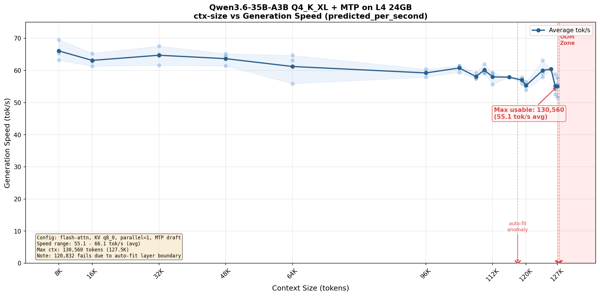

# Qwen3.6-35B-A3B-MTP on NVIDIA L4 24GB

Deploy [Qwen3.6-35B-A3B](https://huggingface.co/Qwen/Qwen3.6-35B-A3B) with MTP (Multi-Token Prediction) speculative decoding on a single NVIDIA L4 24GB GPU using llama.cpp. Achieves 55-66 tok/s generation speed with up to 130K context.

## Hardware

- GPU: NVIDIA L4 24GB (GCE `g2-standard-8` or similar)
- OS: Ubuntu 22.04 (Deep Learning VM, `common-cu129` image family)
- The `common-cu129` image comes with NVIDIA driver + CUDA pre-installed

## Model

- Quantization: [Unsloth Q4_K_XL GGUF](https://huggingface.co/unsloth/Qwen3.6-35B-A3B-MTP-GGUF) (~22GB)
- MTP layers are baked into the same GGUF file
- This is an MoE model (35B total, 3B active), so Q4_K_XL fits in 24GB VRAM

## Setup

### 1. Build llama.cpp from source

Do NOT use Docker. The official `ghcr.io/ggml-org/llama.cpp:server-cuda` image has `libllama-common.so.0` missing issues as of 2026-05. Building from source is faster, more stable, and easier to debug.

```bash
sudo apt-get update && sudo apt-get install -y build-essential cmake
git clone https://github.com/ggml-org/llama.cpp.git
cd llama.cpp
cmake -B build -DGGML_CUDA=ON
cmake --build build -j4 --target llama-server
```

### 2. Download the model

```bash
mkdir -p ~/models
pip install huggingface_hub
huggingface-cli download unsloth/Qwen3.6-35B-A3B-MTP-GGUF \
  Qwen3.6-35B-A3B-UD-Q4_K_XL.gguf \
  --local-dir ~/models/Qwen3.6-35B-A3B-MTP-GGUF
```

### 3. Create the start script

```bash
cat > ~/start-llama.sh << 'EOF'
#!/bin/bash
export LD_LIBRARY_PATH=/home/hanxiao/llama.cpp/build/bin
exec /home/hanxiao/llama.cpp/build/bin/llama-server \
  --model /home/hanxiao/models/Qwen3.6-35B-A3B-MTP-GGUF/Qwen3.6-35B-A3B-UD-Q4_K_XL.gguf \
  --alias Qwen3.6-35B-A3B-Q4KXL-MTP \
  --ctx-size 8192 \
  --parallel 1 \
  --flash-attn on \
  --cache-type-k q8_0 \
  --cache-type-v q8_0 \
  --chat-template-kwargs '{"enable_thinking":true}' \
  --spec-type draft-mtp \
  --spec-draft-n-max 2 \
  --jinja \
  --tools all \
  --host 0.0.0.0 \
  --port 8080
EOF
chmod +x ~/start-llama.sh
```

### 4. Set up systemd

```bash
sudo tee /etc/systemd/system/llama-server.service << 'EOF'
[Unit]
Description=llama.cpp server - Qwen3.6 MTP
After=network.target

[Service]
Type=simple
User=hanxiao
ExecStart=/home/hanxiao/start-llama.sh
Restart=always
RestartSec=5

[Install]
WantedBy=multi-user.target
EOF

sudo systemctl daemon-reload
sudo systemctl enable llama-server
sudo systemctl start llama-server
```

### 5. Expose port 80 (optional)

```bash
# iptables redirect 80 -> 8080
sudo iptables -t nat -A PREROUTING -p tcp --dport 80 -j REDIRECT --to-port 8080

# GCE firewall
gcloud compute firewall-rules create allow-llama-http \
  --project=jinaai-dev --allow=tcp:80 --target-tags=llama-server
gcloud compute firewall-rules create allow-llama-server \
  --project=jinaai-dev --allow=tcp:8080 --target-tags=llama-server
```

## ctx-size Benchmark



Two strategies compared: **auto-fit** (default, lets llama.cpp offload model layers to CPU as needed) vs **n-gpu-layers 999** (force all model layers on GPU).

### Auto-fit + MTP (recommended)

Max ctx: **130,560 tokens (127.5K)**. llama.cpp progressively offloads MoE expert layers to CPU to make room for KV cache. Since inactive MoE experts are compute-light, speed impact is minimal.

| ctx-size | avg tok/s | status |
|----------|-----------|--------|
| 8,192 | 66.1 | OK |
| 16,384 | 63.1 | OK |
| 32,768 | 64.7 | OK |
| 49,152 | 63.7 | OK |
| 65,536 | 61.2 | OK |
| 98,304 | 59.2 | OK |
| 106,496 | 60.8 | OK |
| 114,688 | 58.0 | OK |
| 122,880 | 55.3 | OK |
| 126,976 | 60.0 | OK |
| 130,048 | 55.2 | OK |
| 130,560 | 55.1 | OK (MAX) |
| 130,688 | -- | OOM |

### n-gpu-layers 999, no MTP

Forcing all layers on GPU leaves no VRAM for MTP context - MTP OOMs even at ctx 2048. Without MTP, max ctx is **37,888**.

| ctx-size | avg tok/s | status |
|----------|-----------|--------|
| 2,048 | 63.4 | OK |
| 4,096 | 63.4 | OK |
| 8,192 | 63.4 | OK |
| 16,384 | 63.1 | OK |
| 32,768 | 63.1 | OK |
| 36,864 | 63.5 | OK |
| 37,888 | 63.4 | OK (MAX) |
| 38,016 | -- | OOM |

### Comparison

| | Auto-fit + MTP | n-gpu-layers 999 (no MTP) |
|---|---|---|
| Max ctx | 130,560 (127.5K) | 37,888 (37K) |
| tok/s @ 8K | 66.1 | 63.4 |
| tok/s @ max | 55.1 | 63.4 |
| Context capacity | 3.4x more | baseline |
| Speed cost | -16% at max ctx | flat |

Auto-fit is definitively superior: 3.4x more context with only 16% speed drop. MTP adds ~4% speed bonus on top.

Notes:
- VRAM nearly full at every ctx size (~22.3-22.6 / 23.0 GB)
- 120,832 is an auto-fit anomaly: specific layer boundary causes OOM while 121,856+ works fine
- OOM boundary is razor-thin: 130,560 works, 130,688 crashes

## Usage

```bash
curl http://<IP>:8080/v1/chat/completions \
  -H "Content-Type: application/json" \
  -d '{
    "messages": [{"role": "user", "content": "hello"}],
    "max_tokens": 100
  }'
```

## Operations

```bash
# Status
sudo systemctl status llama-server

# Restart
sudo systemctl restart llama-server

# Logs
sudo journalctl -u llama-server -f

# Speed check
curl -s http://localhost:8080/v1/chat/completions \
  -H "Content-Type: application/json" \
  -d '{"messages":[{"role":"user","content":"hello"}],"max_tokens":100}' \
  | python3 -c "import sys,json;t=json.load(sys.stdin)['timings'];print(f\"{t['predicted_per_second']:.1f} tok/s\")"

# Update llama.cpp
cd ~/llama.cpp && git pull
cmake -B build -DGGML_CUDA=ON
cmake --build build -j4 --target llama-server
sudo systemctl restart llama-server

# Shut down to save cost
gcloud compute instances stop qwen36-mtp-l4 --project=jinaai-dev --zone=us-east1-b
```

## Lessons Learned

### 1. Never set sampling parameters on the server side

Setting `--temp`, `--top-p`, `--top-k`, `--presence-penalty` on the server globally tanks MTP acceptance rate from 85%+ down to 60%+, dropping speed from 70 to 35 tok/s. Sampling parameters alter the probability distribution, causing MTP draft predictions to be rejected at high rates.

Always pass sampling parameters per-request from the client. The server should only handle model loading and inference infrastructure.

### 2. ctx-size and auto-fit behavior on L4

Q4_K_XL (22GB) + MTP nearly fills 24GB VRAM. As ctx-size increases, auto-fit progressively offloads model layers to CPU to make room for KV cache. Surprisingly, speed stays relatively flat (55-66 tok/s) all the way up to 130K ctx because the offloaded layers are compute-light MoE experts.

The max usable ctx-size is 130,560 (127.5K). See the [benchmark section](#ctx-size-benchmark) for full data.

When logs show "tensor overrides to CPU are used with mmap enabled", layers are being offloaded - but this is normal and expected for larger ctx sizes.

### 3. Do not use Docker

- `ghcr.io/ggml-org/llama.cpp:server-cuda` has `libllama-common.so.0` missing issues (2026-05)
- Mirror images need `LD_LIBRARY_PATH=/app` hacks
- Locally compiled llama-server is faster, more stable, and easier to debug

### 4. --n-gpu-layers 999 + MTP = OOM

Forcing all layers to GPU with `--n-gpu-layers 999 --fit off` causes MTP context allocation to OOM on L4, even with ctx-size 8192 and q4_0 KV cache. Let auto-fit handle the allocation.

### 5. Thinking mode barely affects tok/s

Thinking on vs off: ~5% speed difference (65 vs 70 tok/s). The real cost of thinking is more tokens generated (the thinking trace), not slower per-token speed.

### 6. GCE reboot can lose the NVIDIA driver

Kernel auto-upgrades (e.g. `6.8.0-1047` to `6.8.0-1054`) but the NVIDIA kernel module doesn't recompile. After reboot, `nvidia-smi` fails.

Fix: install DKMS once, it auto-compiles for new kernels.

```bash
sudo apt-get install -y nvidia-dkms-570-server-open
sudo modprobe nvidia
```

## Cost

- L4 on-demand: ~$0.81/hr (~$584/month)
- Spot (preemptible): ~$0.24/hr (~$173/month) - not recommended for always-on serving
